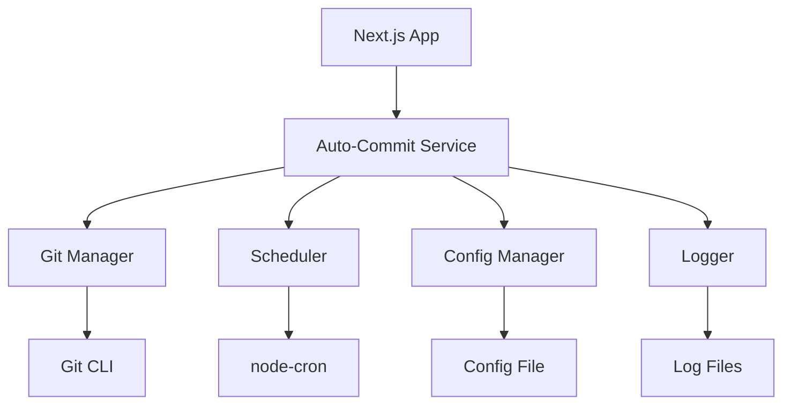

# Design Document

## Overview

The auto-daily-commit system will be implemented as a Next.js application with a built-in background service that monitors Git changes and performs daily commits. The system uses Node.js scheduling capabilities, Git command-line integration, and a simple configuration system to provide automated version control.

## Architecture

The system follows a modular architecture with clear separation of concerns:



### Core Components

1. **Auto-Commit Service**: Main orchestrator that coordinates all operations
2. **Git Manager**: Handles all Git operations and safety checks
3. **Scheduler**: Manages daily timing using node-cron
4. **Config Manager**: Handles configuration loading and validation
5. **Logger**: Provides structured logging for monitoring

## Components and Interfaces

### Auto-Commit Service
```typescript
interface AutoCommitService {
  initialize(): Promise<void>
  start(): Promise<void>
  stop(): Promise<void>
  executeCommit(): Promise<CommitResult>
  getStatus(): ServiceStatus
}
```

### Git Manager
```typescript
interface GitManager {
  hasChanges(): Promise<boolean>
  getChangedFiles(): Promise<string[]>
  createCommit(message: string): Promise<string>
  isRepositoryClean(): Promise<boolean>
  generateCommitMessage(files: string[]): string
}
```

### Configuration System
```typescript
interface AutoCommitConfig {
  enabled: boolean
  commitTime: string // cron format
  messageTemplate: string
  excludePatterns: string[]
  logLevel: 'info' | 'debug' | 'error'
}
```

### Scheduler
```typescript
interface Scheduler {
  schedule(cronExpression: string, callback: () => void): void
  stop(): void
  isRunning(): boolean
}
```

## Data Models

### Commit Result
```typescript
interface CommitResult {
  success: boolean
  commitHash?: string
  message: string
  timestamp: Date
  filesChanged: number
  error?: string
}
```

### Service Status
```typescript
interface ServiceStatus {
  isRunning: boolean
  lastCommit?: Date
  nextScheduledCommit?: Date
  totalCommits: number
  lastError?: string
}
```

### Log Entry
```typescript
interface LogEntry {
  timestamp: Date
  level: 'info' | 'debug' | 'error'
  message: string
  metadata?: Record<string, any>
}
```

## Error Handling

### Git Operation Errors
- **Merge Conflicts**: Skip commit and log warning
- **Detached HEAD**: Skip commit and log warning  
- **Permission Issues**: Log error and retry on next schedule
- **Repository Not Found**: Log error and disable service

### Scheduling Errors
- **Invalid Cron Expression**: Use default schedule and log error
- **System Clock Issues**: Log warning and continue with best effort

### Configuration Errors
- **Invalid Config File**: Use defaults and log error
- **Missing Config**: Create default configuration
- **Permission Issues**: Log error and use in-memory defaults

## Testing Strategy

### Unit Testing
- Git Manager operations with mocked Git commands
- Configuration loading and validation
- Commit message generation logic
- Scheduler functionality

### Integration Testing
- End-to-end commit flow in test repository
- Configuration file handling
- Error scenarios with actual Git repository

### Manual Testing
- Daily operation over extended period
- Various file change scenarios
- Configuration changes during runtime
- Error recovery scenarios

## Implementation Details

### File Structure
```
src/
├── services/
│   ├── auto-commit.service.ts
│   ├── git.manager.ts
│   ├── scheduler.service.ts
│   └── config.manager.ts
├── utils/
│   ├── logger.ts
│   └── file-analyzer.ts
├── types/
│   └── index.ts
└── config/
    └── auto-commit.config.json
```

### Configuration File Location
- Default: `./config/auto-commit.config.json`
- Environment override: `AUTO_COMMIT_CONFIG_PATH`

### Logging Strategy
- Daily log rotation
- Structured JSON logging
- Log levels: debug, info, error
- Maximum 30 days retention

### Commit Message Generation
The system will analyze changed files and generate contextual messages:
- **Code files**: "feat: update application code"
- **Config files**: "config: update configuration"
- **Documentation**: "docs: update documentation"
- **Mixed changes**: "chore: daily auto-commit with multiple updates"
- **Custom patterns**: User-defined templates with placeholders

### Safety Mechanisms
- Check for ongoing Git operations (lock files)
- Verify repository is in clean state
- Skip commits during merge/rebase operations
- Validate Git repository exists and is accessible
- Respect .gitignore patterns

### Next.js Integration
- Service initializes during app startup
- Graceful shutdown on app termination
- Optional API endpoints for status monitoring
- Environment-based configuration (development vs production)